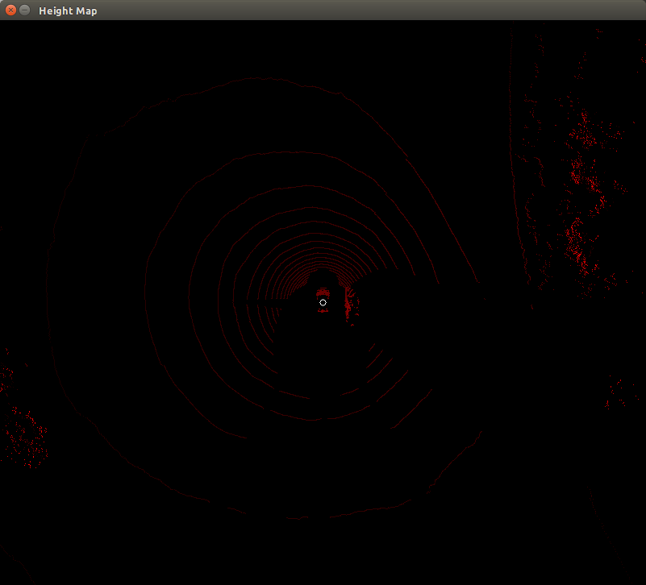

# ROS-Examples
(I never bothered to change the name of this repo. It should probably be... I dunno, Transformers DiDi Challenge Solution or something.)

This repo processes rosbag data to create KITTI-style tracklet files identifying a single vehicle in a LiDAR/radar/camera frame, specifically built for the DiDi Challenge.

## lidar_node
</img>

Currently, this ROS node processes LIDAR data to create PNG "bird's eye" height maps for use in deep learning applications. (The heightmap display is currently disabled.) The lidar node also perfroms a number of PointCloud Library (PCL) functions on the raw point cloud, including:

- downsampling the cloud using a voxel grid
- ground plane segmentation and removal
- removing points above and below certain heights (z-value), and those corresponding to the capture vehicle
- performing euclidean clustering and computing the centroid of each cluster found

This node also consumes rosbag RTK coordinates for the object car and the front and rear of the capture vehicle. These allow the location of the object car to be computed, which is then displayed on the heightmap (when enabled), along with each cluster centroid, and the LiDAR origin. Each cluster is flattened to a top-view, grayscale image. The code to save these images to "car" and "noncar" folders (based on proximity to object car RTK coordinates) for training a machine learning model is currently disabled. Each cluster image and its centroid X and Y coordinates are published using a custom ROS message (`img_with_pose`) on the topic `/heightmap/cluster_and_pose`.

All of the real code currently resides in ```/ros-examples/src/lidar/src/lidar_node.cpp```.

To use this node, first build using `catkin-make`. You'll need OpenCV dependencies, but that should be included in ROS. 

To run: execute ```roscore```, then in a separate terminal execute ```rosrun lidar lidar_node```

You should see an image window pop up if the heightmap is enabled. From there, execute (yes, in another terminal) ```rosbag play your_rosbag.bag -l``` (-l to loop continuously), and (in yet another terminal) ```rosrun velodyne_pointcloud cloud_node _calibration:=/opt/ros/indigo/share/velodyne_pointcloud/params/32db.yaml```.

## clf_and_tracklet

The clf_and_tracklet node subscribes to the `/heightmap/cluster_and_pose` topic from the lidar node and parses `img_with_pose` messages. The image is processed by a convolutional neural network built in Keras and if the cluster image is predicted to belong to a car the X and Y coordinates (contained in the pose portion of the message) are saved along with other hard coded dimensions and all poses are saved to `tracklet_labels.xml` upon exiting (ctrl-c) the node.

The code for this node resides in ```/ros-examples/src/clf/src/clf_and_tracklet.py``` (and the tracklet xml writing code is contained in `generate_tracklet.py` in the same folder).

This node can be run in a separate terminal with the command ```rosrun clf clf_and_tracklet.py```

## model_train

`model_train.py` located in the repo root folder is standalone code used to create a Keras-based CNN car/not-car classifier for 64x64 cluster sample images. These images have already been collected from all of the DiDi Challenge rosbag datasets using `lidar_node` (the code for saving these images has since been commented out) and have been saved to `transformers_didi_data.zip` in the root of this repo. This file should be extracted to the `./images/` folder, where the `model_train.py` code will find them. 

---

## Udacity stuff
Want to learn how to use the Robot Operating System (ROS), the Point Cloud Library (PCL), and a bunch of other cool tools to make a self-driving car or other awesome robot? This repository is home to a collection of ROS nodes that process 3D sensor information, specifically as examples for the Udacity/Didi $100k object detection challenge. Learn about obstacle fusion techniques, and use these nodes as a starting point for building your own awesome obstacle detection engine!

For more info, check out the main competition site [here](https://www.udacity.com/didi-challenge).

### setup
This is a standard ROS catkin-ized workspace. Don't know what that means? Check out a great intro on ROS [here](http://wiki.ros.org/ROS/Tutorials) or head on over to [Udacity](http://udacity.com) to sign up for the Robotics or Self-Driving Car Engineer Nanodegree.

There's currently only one node for processing LIDAR data. Use "catkin_make" in the root of this repo to build the lidar node, and run with ```rosrun lidar lidar_node``` after installing PCL and ROS (Indigo, preferably).

If you've downloaded any of the datasets for the challenge, you can start using the data with these nodes immediately by running ```rosbag play -l name-of-file.bag```. The "-l" keeps the bag file playing on repeat so that you can keep working on your algorithm without having to mess with the data playback.
